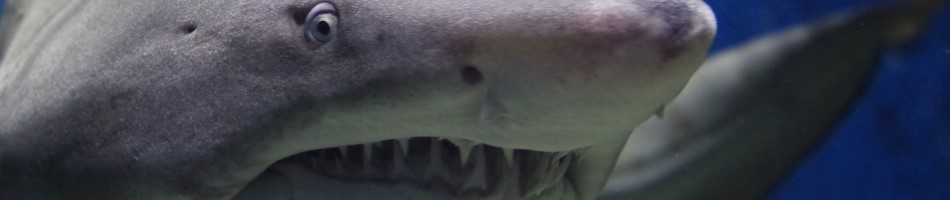

<p align="center">
  
</p>

# 🦈 To swim or not to swim?
### Prédiction du risque d'attaque de requin

*Dédié à ma chérie qui refuse de mettre les pieds dans la mer* 🌊

---

## 👋 Présentation

Dans ce projet, j'analyse plus de **6 000 attaques de requins** recensées dans le monde
depuis le 19ème siècle pour répondre à une question simple :

> *"Est-ce qu'une attaque de requin va être fatale ou non ?"*

J'ai choisi ce sujet car c'est un dataset original et fun — et surtout pour prouver
statistiquement à ma chérie qu'elle peut aller se baigner sans craindre les requins 😅

---

## 📊 Dataset

- **Source** : [Global Shark Attacks - Kaggle](https://www.kaggle.com/datasets/teajay/global-shark-attacks)
- **Taille** : 25 723 lignes, 24 colonnes
- **Période** : depuis le 19ème siècle
- **Après nettoyage** : 2 811 lignes exploitables

---

## 🔍 Ce que j'ai découvert

- 🌍 Les **USA et l'Australie** concentrent la majorité des attaques
- 🏄 Le **surf** est l'activité la plus dangereuse
- 👨 Les **hommes** sont **9x plus attaqués** que les femmes
- 📈 Les attaques augmentent mais sont **de moins en moins mortelles**
- 🦈 Le **grand requin blanc** est l'espèce la plus impliquée

---

## 🤖 Modèles utilisés

| Modèle | Accuracy | Recall Fatal | F1 Fatal |
|---|---|---|---|
| Régression Logistique | 0.87 | 0.05 | 0.10 |
| Random Forest (GridSearch) | 0.86 | 0.09 | 0.15 |
| Random Forest (Randomized Search) | 0.86 | 0.09 | 0.15 |
| Random Forest (Halving) | 0.86 | 0.11 | 0.18 |
| XGBoost | 0.84 | 0.16 | 0.23 |
| **XGBoost équilibré** | **0.80** | **0.25** | **0.27** |

**Meilleur modèle : XGBoost équilibré** — il détecte 25% des attaques fatales
contre seulement 5% pour la régression logistique.

---

## 🛠️ Techniques utilisées

- Exploration et visualisation des données
- Nettoyage et encodage (`pd.factorize`)
- Normalisation (`StandardScaler`)
- Réduction de dimensions (`PCA`)
- Pipeline Scikit-Learn
- GridSearch, Randomized Search, Halving Search
- Bagging (`RandomForest`)
- Boosting (`XGBoost`) avec `scale_pos_weight`
- Validation croisée
- K-Means Clustering (Elbow Method + Silhouette)

---

## 🚀 Installation

```bash
# Cloner le repo
git clone https://github.com/FantoniStephane/shark_attack.git
cd shark-attack

# Installer les dépendances
pip install -r requirements.txt

# Lancer le notebook
jupyter notebook shark_attack.ipynb
```

---

## 📁 Structure du projet

```
shark-attack/
│
├── shark_attack.ipynb      # Notebook principal
├── requirements.txt        # Dépendances
├── README.md               # Ce fichier
└── data/
    └── Global Shark Attacks.csv  # Dataset (à télécharger sur Kaggle)
```

---

## 💑 Réponse à ma chérie

**Les statistiques parlent d'elles-mêmes :**
- ✅ 76% des attaques ne sont **pas fatales**
- ✅ Les femmes sont **9x moins attaquées** que les hommes
- ✅ Évite le **surf** aux **USA et en Australie**
- ✅ Les requins attaquent ~100 personnes par an dans le monde entier sur des **milliards de baignades** !

> 🌊 *Ma chérie peut y aller, les statistiques sont de son côté !* 😄
>
> 🦈 *...mais bon, je comprends quand même qu'elle préfère rester sur la plage* 😅

---

## 👨‍💻 Auteur

Projet réalisé dans le cadre de la formation **CD2IA** à Metz Numeric School.
